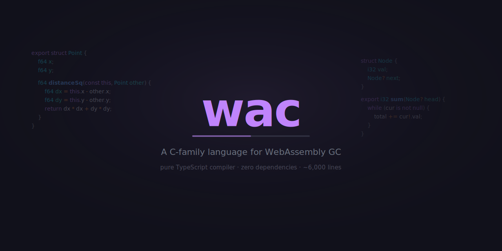

<p align="center">
  
</p>

# wac

A C-family language for WebAssembly GC. Structs, methods, arrays, nullable refs, subtyping.

**[Website](https://voltrevo.github.io/wac/)** · **[Language spec](spec/)**

## Pure TypeScript. Zero dependencies.

The entire compiler — lexer, parser, resolver, type checker, WasmGC emitter, and binary builder — is pure TypeScript with no native code, no LLVM, no binaryen, no wasm toolchain. It runs in the browser and in Deno/Node. The compiler, runtime, and bindgen total ~6,000 lines.

## Example

```wac
export struct Point {
  f64 x;
  f64 y;

  Point create(f64 x, f64 y) {
    return Point(x, y);
  }

  f64 distanceSq(const this, Point other) {
    f64 dx = this.x - other.x;
    f64 dy = this.y - other.y;
    return dx * dx + dy * dy;
  }
}

export f64 run() {
  Point a = Point.create(0.0, 0.0);
  Point b = Point.create(3.0, 4.0);
  return a.distanceSq(b);  // 25.0
}
```

## Language features

- Primitive types: `i32` `i64` `f32` `f64` `bool` `string`
- Structs with methods, `const this`, static methods
- Struct subtyping via `struct Rect : Shape`
- Nullable references with `?`, `!` unwrap, `is null` / `is not null`
- GC arrays: `i32[5]()`, `i32[](1,2,3)`, `.len()`
- Function references: `fn[i32(i32, i32)]`
- File-based imports with `import { x } from "./file.wac"`
- Full control flow: if/else, while, for, do-while, switch, ternary
- Four cast modes: `as` (lossless), `as!` (checked), `as~` (lossy), `as@` (raw)

## TypeScript bindgen

`wacBindgen` produces a self-contained `.ts` file with the wasm binary base64-encoded inline and typed wrapper functions. Zero runtime dependencies. Primitive arrays (`i32[]`, `f64[]`, etc.) automatically marshal between JS typed arrays and WasmGC arrays.

## How it was built

The [language spec](spec/) (21 markdown files) was written collaboratively by a human and AI. Then the compiler was implemented autonomously by Claude Sonnet from the spec combined with some general instructions, with zero user intervention. See [how to reproduce](how-to-reproduce/).

- **6 hours** — initial run: lex, parse, resolve, typecheck, WasmGC emit, binary builder, instantiation (679 tests)
- **1 hour 8 minutes** — "you missed things, reread the spec": added bindgen, diagnostics, strings (734 tests)
- **25 minutes** — spec updated, implement changes: fixed all identified bugs (749 tests)

Grand total: **~7.5 hours** of Claude Sonnet compute — 18% of the weekly quota on Claude Max 5x ($18).

In each case the agent was not told what was wrong — it figured it out from the spec.

## Development

```sh
npm install
npm run dev      # dev server with playground
npm run build    # production build
deno test        # run compiler tests
```

## License

MIT
