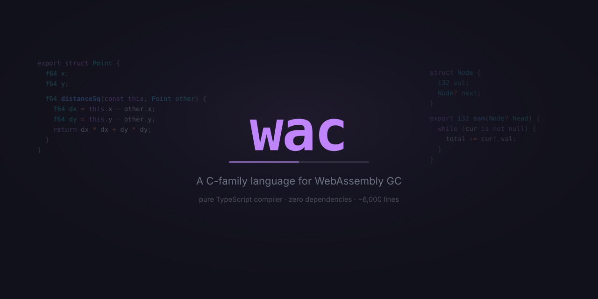

<p align="center">
  
</p>

# wac

A C-family language for WebAssembly GC. Structs, methods, arrays, nullable refs, subtyping.

**[Website](https://voltrevo.github.io/wac/)** · **[Language spec](spec/)**

## Pure TypeScript. Zero dependencies.

The entire compiler — lexer, parser, resolver, type checker, WasmGC emitter, and binary builder — is pure TypeScript with no native code, no LLVM, no binaryen, no wasm toolchain. It runs in the browser and in Deno/Node. The compiler, runtime, and bindgen total ~6,000 lines.

## Example

```wac
export struct Point {
  f64 x;
  f64 y;

  Point create(f64 x, f64 y) {
    return Point(x, y);
  }

  f64 distanceSq(const this, Point other) {
    f64 dx = this.x - other.x;
    f64 dy = this.y - other.y;
    return dx * dx + dy * dy;
  }
}

export f64 run() {
  Point a = Point.create(0.0, 0.0);
  Point b = Point.create(3.0, 4.0);
  return a.distanceSq(b);  // 25.0
}
```

## Language features

- Primitive types: `i32` `i64` `f32` `f64` `bool` `string`
- Structs with methods, `const this`, static methods
- Struct subtyping via `struct Rect : Shape`
- Nullable references with `?`, `!` unwrap, `is null` / `is not null`
- GC arrays: `i32[5]()`, `i32[](1,2,3)`, `.len()`
- Function references: `fn[i32(i32, i32)]`
- File-based imports with `import { x } from "./file.wac"`
- Full control flow: if/else, while, for, do-while, switch, ternary
- Four cast modes: `as` (lossless), `as!` (checked), `as~` (lossy), `as@` (raw)

## TypeScript bindgen

`wacBindgen` produces a self-contained `.ts` file with the wasm binary base64-encoded inline and typed wrapper functions. Zero runtime dependencies. Primitive arrays (`i32[]`, `f64[]`, etc.) automatically marshal between JS typed arrays and WasmGC arrays, and structs and enums cross as generated classes.

An export may take a JavaScript function — `export i32 fold(fn[i32(i32,i32)] f, i32[] xs)` is called as `fold((a, b) => a + b, [1, 2, 3])`. Passing it is the only way a host function becomes reachable: wac has no import syntax, so a module that takes no `fn[…]` parameter has no wasm imports at all and cannot call out. What a module can reach is what you hand it.

Arrays of references (`string[]`, arrays of structs, nested arrays), nullable primitives (`number | null`), static methods, and functions returned from wac all cross too — enough that `std`'s generic `Map` can be built and driven entirely from JavaScript:

```ts
const m = Map_i32_i32.create((k) => hash(k), (a, b) => a === b);
m.set(1, 99);
m.get(1).toObject();     // { tag: "Some", v: 99 }
```

## What a wac module requires

MVP plus non-trapping float→int conversions, reference types, typed function references, and
garbage collection — Chrome 119+, Firefox 120+, Safari 18.2+, Node 22+, Deno. All shipped, none
behind a flag.

That is the floor, and it is deliberate: nothing is emitted from a proposal that is not broadly
supported. There are no bulk-memory, exception-handling, tail-call or SIMD opcodes in the emitter.
A feature that would cross this line — JSPI, for instance, which the callback design happens to
make available to a host that wants it — is a decision to take explicitly, not a convenience to
adopt because an engine you have to hand supports it.

## Development

```sh
npm install
npm run dev      # dev server with playground
npm run build    # production build
deno test -A     # run compiler tests (bindgen tests write to a temp dir)
```

## License

MIT
