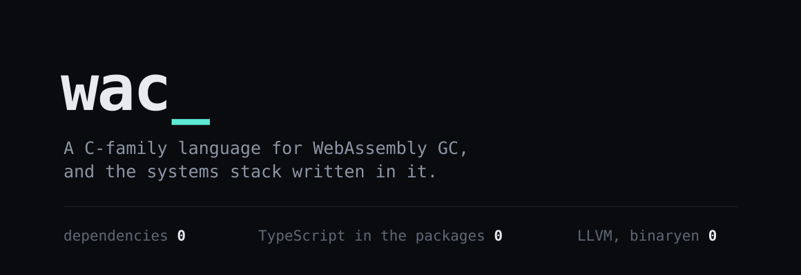

<p align="center">
  
</p>

# wac

A C-family language for WebAssembly GC, and the systems stack written in it.

**[Website](https://voltrevo.github.io/wac/)** · **[Get the command](docs/your-own-project.md)** ·
**[Language](spec/)** · **[Packages](packages/)** · **[Docs](docs/)** · **[Design](design/)**

## Meet wacland: userland written in wac

A shell, 65 applets and a filesystem — and all of it is wac. Not busybox compiled to wasm, not a
libc port, not wac glue around somebody else's binaries: it is `packages/sh` itself, the same program
that runs on a command line, and the only thing underneath it is the compiler.

```
$ seq 1 20 | grep 7 | wc -l
2
$ echo 'a whole new stack' | gzip -c | wc -c
41
$ echo hello | sha256sum
5891b5b522d5df086d0ff0b110fbd9d21bb4fc7163af34d08286a2e846f6be03  -
```

Those three lines are not a screenshot. `packages/box/test/wac/frontpage_test.wac` runs them through
`packages/box/example/boxsh.wac` and fails if the output ever stops matching.

It runs [in a browser tab](https://voltrevo.github.io/wac/) over a filesystem that survives a reload,
on Deno and Node, and on a host with no JavaScript in it at all — Rust on wasmtime, in `native/`.
Log in over real OpenSSH and you land in that shell, with a process table you can `ps` and `kill` and
a `^C` that interrupts. None of it touches the machine it happens to be running on.

The goal it is being built against is [`design/system/0001`](design/system/0001-a-self-contained-system.md):
the same image loaded in two substantially different hosts, showing the same users, files, programs,
shell behaviour and services in both. Seven of its eight steps are done; the eighth, a desktop, has
started.

## And this is the language it is written in

```wac
export string main() {
  Option<string> name = Option.None;
  // Option<string> name = Option.Some("Alice and Bob");

  return "Hello, " + match (name) {
    case Some(v): v,
    case None: "world"
  } + "!";
}

/// A value that might not be there. Declared after it is used — wac has no
/// forward declarations, because a file is a set of declarations rather than
/// a sequence of them.
enum Option<T> {
  Some(T value),
  None
}
```

Structs with methods and subtyping, monomorphised generics, enums with payloads and exhaustive
`match`, nullable references, GC arrays, function references, and four cast modes that say what they
cost — `as` lossless, `as!` checked, `as~` lossy, `as@` raw.

The collector owns the heap, so there is no allocator to write and no linear memory in the artifact.
The compiler is about 19,000 lines of TypeScript with no LLVM, no binaryen and nothing to install,
and it runs in a browser as readily as on a command line.

[`spec/tour.wac`](spec/tour.wac) is the whole language in one annotated file that compiles and
self-tests — much faster than reading the specification, and the right starting point before writing
any wac.

There is a second surface. `.wapy` is Python-flavoured — `def`, `class`, indentation, `and`/`or`/`not`
— and is *not* Python: it does not accept Python, and copying Python into it is an explicit
anti-goal. A `.wac` file may import a `.wapy` file and the reverse, and nothing after parsing can
tell which produced a given declaration. See [`spec/spec/wapy.md`](spec/spec/wapy.md).

## The compiler, written in wac

The compiler above is TypeScript. It is being replaced by itself. `packages/wacc` is that compiler
written in wac — lexer, parser, type checker, emitter — and a compiler is the program shape this
language is worst at: syntax trees want sum types, symbol tables want generics, everything wants
strings. Writing one is how the language finds out what it is missing, with a real consumer rather
than by argument.

```
stage A   wacc, built by the TypeScript compiler
stage B   wacc, built by stage A
stage C   wacc, as stage B compiles it

B == C    220 sources, 1.6 MB, identical
```

The jump from *16 sources, 968 KB* — what this said until 2026-08-25 — is `issues/system/0257c`
rather than the compiler growing: the seed's entry is `packages/wac/src/wac.wac`, and that is now one
program carrying the compiler, the shell and the fetcher instead of three payloads beside each other,
so the graph it builds absorbed box's applets.

Every rung was checked against the TypeScript compiler before the next was started — token streams,
syntax trees, then diagnostics at exact positions. The type checker was finished against four
independent corpora, the newest being this repository's own **1077** wac files, with no false alarm
among them.

The emitter compiles **all 1077** of them whole — none partially, none invalidly. It was 702 of 729
five days earlier and 411 of 414 six days before that, so the interesting property is not the number
but that the number is *printed by the rung that produces it*: the corpus is the live repository, and
code written for other reasons keeps arriving using things the emitter has not reached, so this goes
down as well as up.

A rung that can no longer fail is a rung that has stopped measuring, so the check that the walk is
running no longer asks the corpus to contain a defect — it asks the emitter about four lines that it
must decline, and asks that the refusal name a language construct.

Every number in this section is printed by the rung that produces it, and read on 2026-08-25:
`wac test packages/wacc/test/wac/corpusemit_test.wac` for the corpus and the emitter — it is in the
heavy lane, thirty-three minutes when it was last run on a machine three agents share, because it
compiles the tree — and `wac task seed` for the size, which is printed to the byte and rounded here.
It is **1,675,320** bytes; the day the figure above was first written it moved three times, 960,310,
then 965,855, then 968,370, which is the reason it is rounded rather than quoted.
Three days earlier they were 414 files, 411 whole, three partial and 431,705 bytes; six days before
that, 354, 346, 8 and 266,164. The figures move because the repository does.

**wacc builds this repository now.** Applications go through it (`packages/platform/build.ts`), the
`wac` binary carries a wacc-built compiler inside it, and coverage instruments with it. The reference
is the seed: it produces the first `wacc.wasm` from a cold checkout, and the specification describes
`packages/wacc` instead. The one place it still emits by default is the *bytes the test suite runs* —
`harness/wacBind.ts` takes the interface from wacc and the code from the reference unless
`WAC_WASM_FROM=wacc` says otherwise, which is the last rung of the swap rather than a hedge about it.

## Tor

A client that verifies a consensus and builds circuits; a SOCKS5 proxy; a relay; a directory
authority; onion services. On this repository's own TLS 1.3, on its own crypto, with nothing borrowed
from the C implementation but the specification.

The strongest evidence is somebody else's client — an unmodified `curl`, through our SOCKS proxy,
fetching a page from an onion service we host. And it works the other way round: a real C tor
bootstraps from our directory authority, builds a three-hop circuit through our relays and carries a
stream over it, reaching *Bootstrapped 100%* having accepted our descriptor, certificate, vote and
both consensus flavours through its own parsers.

## Ethereum

Ask a node who owns a name, or what a balance is, and you believe what it tells you. There is no way
to check — you are trusting whoever runs the endpoint, and a wrong answer looks exactly like a right
one.

This checks. It follows the chain's headers itself and verifies the committee signatures on them, so
a header it accepts is one that was signed rather than one a server asserted. Every answer is then
proved against that header: a node returns the value *and* the path through the trie that leads to
it, and a value somebody altered cannot produce a path that still hashes to the root. Worked all the
way through, that is `vitalik.eth` resolving without trust.

## 38 packages, 129k lines of wac, no dependencies

In dependency order, nothing importing anything above it. No C, no libc, no runtime library, and no
third-party code in any package's `src/`.

TLS 1.3 interoperating with OpenSSL and rustls. SSH at both ends — a client that runs commands on
OpenSSH, and a server that serves OpenSSH's own client. SHA-2, SHA-3, HMAC, HKDF, AES-GCM,
ChaCha20-Poly1305, X25519, Ed25519, P-256, P-384, RSA, ML-KEM-768, and BLS12-381 pairings. gzip and
Zstandard, both compressing at or under the reference tools. A capability world so a program can read
files and open sockets with no TypeScript of its own.

[`MAP.md`](MAP.md) is generated from the tree and lists every package and every program, with its
size and test count.

## How it is checked

Almost nothing here is tested against an expectation somebody typed. The applets are compared against
GNU coreutils, the shell against bash script for script, the regex engine against GNU grep byte by
byte, the crypto against test vectors, TLS against OpenSSL, Tor against C tor, and the wac compiler
against the TypeScript one. Where a differential found a disagreement and *we* were right, the other
side got an issue rather than us getting a workaround.

```sh
wac task test        # three to four minutes, depending on the machine
```

## Where things are

```
spec/          the language: definition, tour, CLI documentation
compiler/      the reference — lexer to WasmGC emitter, in TypeScript; now the seed that builds wacc
packages/      the packages written in wac, including wacc, the compiler ported to wac
native/        the host with no JavaScript in it: Rust on wasmtime
harness/       the test harness the packages share
site/          the website — the only npm subtree
tools/         repo-wide tooling
docs/          detail that is not the language and not a package
design/lang/   design/system/
issues/lang/   issues/system/
```

`issues/` and `design/` split by category rather than provenance because both trees numbered from
0001 and 79 numbers collide. "wac 0076" means [`issues/lang/`](issues/lang/), "wac-mono 0103" means
[`issues/system/`](issues/system/).

**This repository was two repositories until 2026-08-09** — `wac`, the language and its compiler, and
`wac-mono`, the packages written in it. See [`MERGE.md`](MERGE.md) if anything about the layout
surprises you.

## More

| | |
| --- | --- |
| [`docs/your-own-project.md`](docs/your-own-project.md) | Installing `wac` and using it outside this repository — every step run in an empty directory |
| [`docs/`](docs/) | Integer overflow, constant-time checking, the wasm floor, development |
| [`spec/`](spec/) | The language, [the tour](spec/tour.wac), [bindgen](spec/spec/bindgen.md), [the command](spec/cli/wac.md) |
| [`design/`](design/) | Why things are the way they are |
| [`issues/`](issues/) | What is known to be wrong |
| [`WASM-WISHLIST.md`](WASM-WISHLIST.md) | What wac wanted from WebAssembly and could not have |
| [`CONTRIBUTING.md`](CONTRIBUTING.md) | Read before touching `compiler/` |
| [`compiler/README.md`](compiler/README.md) | What the reference is for now, and the shared subset |

## License

MIT
